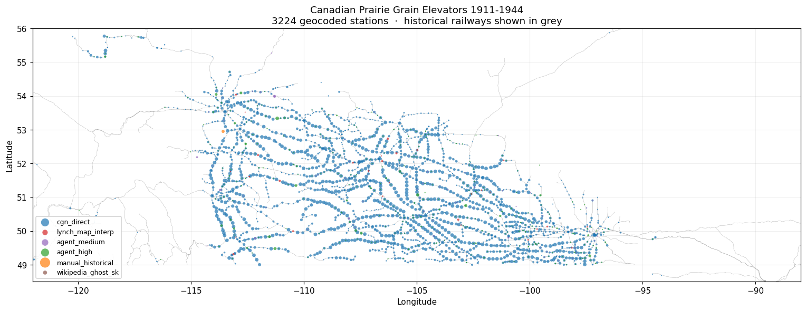

# Canadian Prairie Grain Elevators 1911-1944

Geocoded inventory of grain elevators across Manitoba, Saskatchewan, Alberta, BC, ON, and QC, derived from the **Board of Grain Commissioners of Canada** annual licensing directories (1911-1944), processed via OCR and reconciled against multiple geographic authorities.

## Quick stats

| | |
|---|---|
| Source volumes | 23 license-year directories (1911-12 through 1943-44) |
| Total elevator-row mentions | 98,774 |
| Distinct station locations | 4,858 |
| Distinct elevator-operations (station × owner) | ~26,340 |
| Geocoded rows | 94,217 (94.7%) |
| Top operators | Saskatchewan Pool (1,215 locations), United Grain Growers (841), Alberta Pacific Grain (675) |

## Visualization

- **`docs/overview.png`** — static prairie-wide overview (above)
- **`docs/index.html`** — interactive Leaflet map with rail lines + clickable elevator markers (clone repo and open locally, or host via GitHub Pages)
- **`docs/stations.geojson`** — auto-rendered by GitHub if you click it: <https://github.com/jburnford/wheat/blob/main/docs/stations.geojson>
- **`docs/rail_lines.geojson`** — historical Canadian railway network (1836-1922) reprojected from NRCan's *HR_rails_NEW* shapefile

## Coordinate sources

Each station's `coord_source` field traces how its lat/lon was obtained:

| Source | Description |
|---|---|
| `cgn_direct` | Direct match against the Canadian Geographical Names Database (CGNDB) |
| `agent_high` / `agent_medium` | OCR-variant resolution by an LLM agent against CGNDB candidates |
| `hr_places` | Match against NRCan's *Historical Railway Places* shapefile |
| `manual_historical` | Hand-coded for places renamed/merged (Port Arthur→Thunder Bay, Hobbema→Maskwacis) |
| `lynch_map_interp` | Interpolated as midpoint between two anchored neighbors on the 1933 Lynch elevator map |
| `wikipedia_ghost_sk` | Cross-referenced against Wikipedia's *List of ghost towns in Saskatchewan* |

## Pipeline

Scripts in `scripts/` form a reproducible pipeline:

1. **`parse_elevators.py`** — Markdown (Chandra OCR output) → flat table
2. **`reconcile_stations.py`** — Match stations to *hr_places* + *csd_verified_matches*
3. **`railway_crosswalk.py`** — Resolve directory railway names to *hr_codes* CODE
4. **`normalize_owners.py`** — Canonicalize grain-company names
5. **`match_cgndb.py`** — Match against CGNDB Populated Places
6. **`build_candidates.py`** — Generate top-5 fuzzy CGN candidates per unmatched station
7. **`merge_resolutions.py`** — Apply LLM-agent resolutions
8. **`filter_artifacts.py`** — Mark parser noise (cross-references, OCR garbage)
9. **`apply_external_coords.py`** — Apply manual + Wikipedia ghost-town fixes
10. **`interpolate_from_rail_lines.py`** — Auto-interpolate from Lynch-map line orderings
11. **`build_geojson.py`** — Generate station GeoJSON
12. **`build_map.py`** — Generate interactive Leaflet map + static PNG

## Data

- **`tables/stations_geocoded.csv`** — One row per (station, province) with coords + provenance
- **`tables/elevators_geocoded.csv`** *(not in repo, see scripts to rebuild)* — Per-row license records
- **`tables/rail_lines.jsonl`** — 198 ordered rail-line station sequences extracted from the 1933 Lynch elevator map
- **`tables/ghost_towns_sk.csv`** — Wikipedia's SK ghost-town list with coords (parsed locally)
- **`docs/elevator_ops_summary.csv`** — Per-station summary with first/last year, top operator, max capacity

## Sources

- **Board of Grain Commissioners of Canada** annual licensing directories, 1911-1944 (digitized via Internet Archive)
- **Lynch, F.C.C.** *Elevator Map of Manitoba, Saskatchewan & Alberta*, 8th ed. 1933, Department of the Interior, Natural Resources Intelligence Service (Internet Archive WCW_M000525)
- **Canadian Geographical Names Database (CGNDB)**, Natural Resources Canada
- **Historical Railways 1836-1922** shapefile, ESRI Canada / National Atlas of Canada
- **Wikipedia** ghost-town lists (Saskatchewan)

## Acknowledgements

Built with OCR via [olmocr](https://github.com/allenai/olmocr) and [chandra-ocr-2](https://huggingface.co/datalab-to/chandra-ocr-2) on Compute Canada infrastructure. Map extraction assisted by Gemini and Claude.
